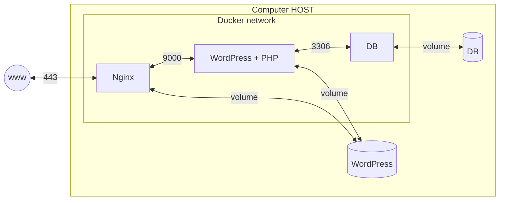

# inception

42 (https://42.fr/en/) の課題として、Dockerを使ったWordpressの環境構築を行いました。

課題要件は下記にまとめられています。

## structure
- containers
  - Nginx (TLSv1.2 or TLSv1.3)
  - WordPress without Nginx
  - MariaDB without Nginx
- volumes
  - your WordPress database
  - your WordPress website files

## note
- Read about:
  - PID 1
  - best practice for writing Dockerfile
- WordPress database
  - two users
    - one of them being the administrators
    - The administrator's username can't contain admin/Admin.
- volumes
  - is available in the `/home/[login]/data` folder
- domain
  - You have to configure your domain name so it points to your local IP address.
  - This domain name must be `[login].42.fr`.
- environment variables
  - must use
  - recommend to use `.env`
    - `.env` should be located at `srcs`
- nginx
  - the port `443` only
    - using the TLSv1.2 or TLSv1.3 protocol

## forbidden
- using network
  - like `host`, `--link` or `links`
  - The network line must be present in your docker-compose.yml file.
- a command running an infinite loop
  - like `tail -f`, `bash`, `sleep infinity`, `while true`
- `latest` tag
- No password must be present in your Dockerfile.
